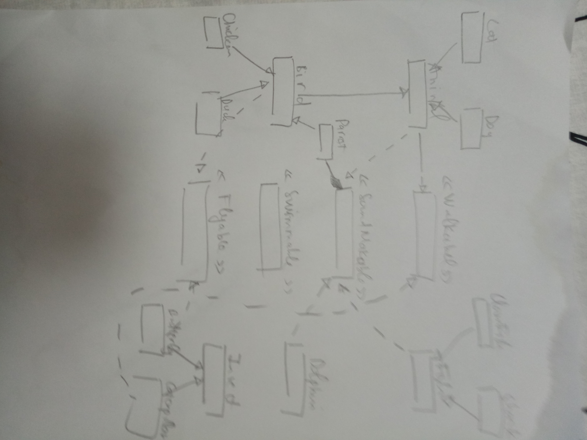

# A coding challenge to illustrate the ability to model the world
Using maven to manage the project. Using the following command to run the tests and build the app
```
mvn clean install
```
## Question A1
### Unit test methods
Need to mock up or spy System.out object
### Increase maintainability
By following principles of encapsulation, inheritance and polymorphism
- Make Animal an abstract class
- Make methods of Animal class protected
- Make fly/sing methods of Bird class public
## Question A2
- Create Duck and Chicken classes extending Bird class
- For Duck class, override method sing() and create a new method swim()
- For Chicken, override methods sing() and fly()
## Question A3
- A straightforward way is to create a new class Rooster
- It extends Chicken class, then overrides method sing()
- Another way is to create a new field "type" in Chicken class. Then implementing sing method depending on the type.
## Question A4
- In order to make Parrot maintainable, we model an object that can create sound by interface SoundMaker. Animal class will implement this interface.
Then in Parrot class, we have a field "liveNear" that is a SoundMaker.
- If we need another parrot lives near a Duck, the following snippet can be used
```
Parrot parrot = new Parrot();
parrot.getLiveNear(new Duck());
```
- If we need another parrot lives near a phone that rings frequently, we can create a new class like Phone that implements SoundMaker then create a new parrot like
```
Parrot parrot = new Parrot();
parrot.getLiveNear(new Phone());
```
## Question B
- We can create a new interface Swimmable to model the ability to swim. So that a Dolphin will be Swimmable, but a Dolphin is not a Fish
## Question D
- Model abilities by interfaces Flyable, SoundMakable, Swimmable and Walkable
- Model the transformation of an insect by ENUM InsectLifecycle
## Question D
- Class hierarchy of the system is as follows

- To count the number of objects, please see the solution at Solution class
```
        Object[] objects = new Object[]{
                new Bird(),
                new Duck(),
                new Chicken(),
                new Parrot(),
                new Fish(),
                new Shark(),
                new Clownfish(),
                new Dolphin(),
                new Dog(),
                new Butterfly(),
                new Cat()
        };
        int[] counts = new int[4];
        Arrays.fill(counts, 0);
        Arrays.stream(objects).forEach(object -> {
            if (object instanceof Flyable){
                counts[0] ++;
            }
            if (object instanceof Walkable){
                counts[1] ++;
            }
            if (object instanceof SoundMakable){
                counts[2] ++;
            }
            if (object instanceof Swimmable){
                counts[3] ++;
            }
        });
        System.out.println("Number of animals that can fly " + counts[0]);
        System.out.println("Number of animals that can walk " + counts[1]);
        System.out.println("Number of animals that can sing " + counts[2]);
        System.out.println("Number of animals that can swim " + counts[3]);
```